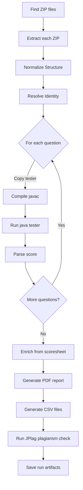
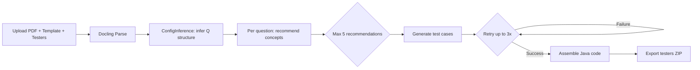
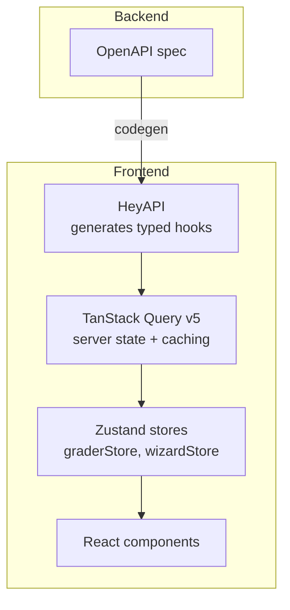

# Architecture

## High-Level Overview

The auto-grader is a full-stack application with three backend services and one frontend, all run via Docker Compose:

```
┌─────────────────┐
│    frontend     │  React 19 + Vite + TypeScript (nginx)
│  (port 5173)    │  HeyAPI-generated hooks, TanStack Query, Zustand
└────────┬────────┘
         │ HTTP / SSE
┌────────▼────────┐
│    backend      │  Spring Boot 3.5 (Java 25, Gradle 9)
│   (port 8080)   │  REST API + SSE streaming grading
└────────┬────────┘
         │
┌────────▼────────┐       ┌──────────────────┐
│    docling      │       │ plagiarism-viewer │  Vue.js app (git-cloned JPlag viewer,
│  (port 5001)    │       │  (port 1996)      │  docker-ized for easy deployment)
│  PDF OCR/Parsing │       └──────────────────┘
└─────────────────┘
```

**Plagiarism viewer** is a git-cloned copy of the official [JPlag report viewer](https://github.com/jplag/JPlag), added to this repo and docker-ized so it can be spun up alongside the other services. No modifications were made to the JPlag viewer itself beyond dependency updates.

---

## Package Map

All Java source lives under `src/main/java/com/is442/autograder/`.

### `execution/`
| Class | Responsibility |
|-------|----------------|
| `GradingEngine` | Orchestrates per-question grading: copy tester → `javac` → `java` → parse score. Handles partial scores on timeout. |
| `ProcessRunner` | Thin wrapper around `javac` / `java` processes. Bounded by configurable timeout. |
| `PlagiarismChecker` | Runs JPlag 6.3.0 on extracted student code. Outputs a `.jplag` zip consumed by the plagiarism viewer. |

### `extraction/`
| Class | Responsibility |
|-------|----------------|
| `ZipExtractor` | Extracts ZIP archives with security guards: zip-bomb protection (entry count + total size), path traversal prevention (`..` check), macOS metadata skip. |
| `IdentityResolver` | Parses student identity from Java file header comments (`Name: ...`, `Email ID: ...`). Falls back to zip filename. Derives display name from username via Title Case. |
| `StructureNormalizer` | Detects and flattens common submission folder nesting issues (e.g., `StudentName/Q1.java` → `Q1.java`). |

### `generation/`
| Class | Responsibility |
|-------|----------------|
| `TestGenerationService` | Orchestrates AI test generation. Builds prompts from question context, calls the LLM via LangChain4j, retries up to 3 times, assembles Java code via `TesterFileWriter`. |
| `LangChainService` | LangChain4j AI service interface with two Spring beans: **vision** (Mimo Omni, for PDFs with images) and **text** (MiniMax, for text-only). |
| `PdfParser` | HTTP client for Docling Serve. Sends PDF → receives Markdown with embedded base64 images. Also provides `extractQuestionSectionFromMarkdown()` for per-question extraction. |
| `ConfigInferenceService` | Auto-detects question structure from folder names and PDF content. Maps `Q1a`, `Q2b` → tester class names, max scores, dependency folders. |
| `TesterFileWriter` | Converts structured test case data into runnable JUnit-style Java tester code. |

### `reporting/`
| Class | Responsibility |
|-------|----------------|
| `PdfReportGenerator` | Generates the instructor PDF report (OpenPDF + JFreeChart). 7 sections: overview, question performance, anomaly summary, structural validation, execution diagnostics, per-student results, insights. |
| `CSVExporter` | Produces `IS442-ScoreSheet-Graded.csv` — compatible with LMS grade import. |
| `DetailedCsvExporter` | Produces `detailed-report.csv` — per-question breakdown for all students. |
| `ConsoleReporter` | Prints human-readable progress to CLI / terminal during grading. |
| `ChartGenerator` | Generates PNG charts (score distribution, pass rate, anomaly frequency) via JFreeChart, embedded in the PDF. |

### `web/`
| Class | Responsibility |
|-------|----------------|
| `GradingStreamController` | REST endpoints for grading. Streams live progress via SSE (`SseEmitter` on a 4-thread executor). Handles cancellation. |
| `ExamController` | Handles exam PDF upload, parsing, and analysis. |
| `GenerationController` | Orchestrates the AI test generation wizard: setup → recommend → generate. |
| `ReportsController` | Serves past run artifacts: PDF, CSV, JPlag zip, per-student code, tester files. |
| `UploadRegistry` | `ConcurrentHashMap<UUID, Path>` — holds uploaded file paths in memory across API calls within a session. |

### `data/`
| Class | Responsibility |
|-------|----------------|
| `SessionDatabase` | SQLite session cache (file: `data/session.db`). Avoids re-parsing the same PDF across multiple API calls. |

### `config/`
| Class | Responsibility |
|-------|----------------|
| `AppConfig` | Loads config from `config.properties` (external) with fallback to `application.properties` (classpath). |

### `model/`
Immutable record classes: `StudentSubmission`, `QuestionResult`, `Anomaly`, `InferredConfig`, `QuestionConfig`, `GeneratedTestCase`, `TestCaseRecommendation`, etc.

### `ui/`
| Class | Responsibility |
|-------|----------------|
| `ConsoleUI` | Lanterna TUI for the interactive CLI mode. Dark-blue top bar, step-by-step prompts, live grading output. |

---

## Design Decisions

### SQLite Session Cache
The backend uses a **file-based SQLite database** (`data/session.db`) as a session cache — NOT a full application database. No authentication or complex schema needed.

**Why SQLite:**
- Zero-config, zero-ops — file-based, no server process
- Avoids re-parsing the same PDF across multiple API calls in one session
- Cache persists across API calls; not cleared until exam session ends

**Three tables:**

| Table | Purpose |
|-------|---------|
| `exams` | `id`, `original_filename`, `parsed_markdown` (full PDF content) |
| `questions` | Per-question markdown sections, folder names, tester class names, max scores |
| `exam_configs` | Cached `InferredConfig` JSON per exam |

**Caching flow:**
1. Instructor uploads PDF → stored in temp file, UUID assigned
2. On `/analyze` or `/parse` → `PdfParser` calls Docling → markdown stored in `exams` table
3. On each question generation → `GenerationController.loadExamContext()` checks `questions` table first
4. Only re-parses if not found → avoids repeated Docling calls (slow/expensive)

**Implementation note:** This is plain JDBC with hand-written SQL and manual `ResultSet` parsing. No JPA, no Hibernate.

---

### UploadRegistry — In-Memory Upload Session Store

Uploaded files are held in a `ConcurrentHashMap<UUID, Path>` (`UploadRegistry`) so they persist across multiple API calls within the same wizard session. Without it, files would be lost between HTTP requests since REST is stateless.

- Keys: UUIDs returned to the frontend after each upload step
- Values: `Path` to temp files on disk (temp files deleted on JVM exit via `deleteOnExit()`)
- Not persisted to disk — lives only in the Spring bean scope

---

### Two LangChain4j AI Service Beans

`WebConfig` creates two separate `LangChainService` beans, selected at call time based on whether the PDF contains images:

| Bean | Qualifier | Model | When used |
|------|-----------|-------|-----------|
| Vision | `@Qualifier("vision")` | `xiaomi/mimo-v2-omni` | PDF contains embedded base64 images |
| Text | `@Qualifier("text")` | `MiniMax` (via OpenRouter) | Text-only PDF, no images |

Selection logic (`TestGenerationService.selectService()`):
```java
return imageUris.isEmpty() ? langChainServiceText : langChainServiceVision;
```

Images are extracted from markdown as base64 data URIs and passed separately to the vision model.

---

### Max 3 AI Retries with Linear Backoff

`TestGenerationService` retries on:
- Null or blank response
- JSON parse failure
- LLM API exception

```java
for (int attempt = 1; attempt <= MAX_AI_ATTEMPTS; attempt++) {
    // call AI
    if (success) break;
    Thread.sleep(3000L * attempt); // 3s, 6s, 9s
}
```

After 3 failures, returns a `GenerationResult` with `success=false` and an error message.

---

### Max 5 Test Cases Per Question

The recommendation prompt instructs the AI to return **at most 5 concepts** in `conceptsToCover`. The generation prompt also requests exactly `N` test cases where `N` is the recommended count (capped at 5). This prevents token explosion and keeps test suites focused.

---

### SSE Streaming for Live Grading

`GradingStreamController` uses Spring's `SseEmitter` on a 4-thread `TaskExecutor` to stream grading progress to the frontend in real time. Events emitted:

| Event | Trigger |
|-------|---------|
| `StudentStartedEvent` | Student ZIP processing begins |
| `StudentGradedEvent` | Student grading completes (includes score, anomalies) |
| `PipelineProgressEvent` | Overall progress update |
| `PipelineCompleteEvent` | All students graded |
| `PipelineErrorEvent` | Unhandled error |

---

### Identity Resolution from Java Headers

Students must include a header comment in each `.java` file:
```java
/*
 * Name: Ping Lee
 * Email ID: ping.lee.2023
 */
```

`IdentityResolver` parses this with regex (`\*\s*Name\s*:\s*([^*$]+)`). Falls back to deriving a display name from the zip filename (e.g., `ping.lee.2023.zip` → "Ping Lee").

---

### Questions Auto-Inferred — No Manual Config

`ConfigInferenceService` detects question structure automatically:
- Scans folder names for patterns like `Q1a`, `Q2b`
- Cross-references with PDF content headings
- Maps each question to its tester class name (from existing testers folder)
- Infers max scores from question text or defaults

If inference is uncertain, instructors can review and correct in the **Review** step of the wizard before generation begins.

---

## Diagrams

### Grading Pipeline



### AI Test Generation Flow



### Frontend State Architecture



**HeyAPI** reads the OpenAPI spec (`openapi.yaml` served by Spring Boot at `/v3/api-docs`) and auto-generates TypeScript types + TanStack Query hooks. This eliminates manual API wiring between frontend and backend.
